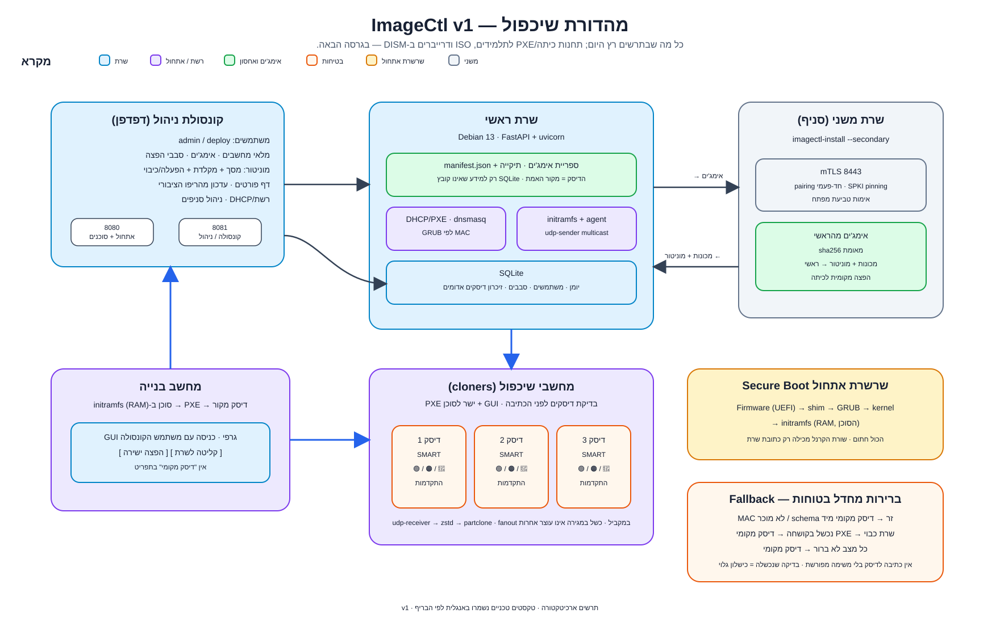
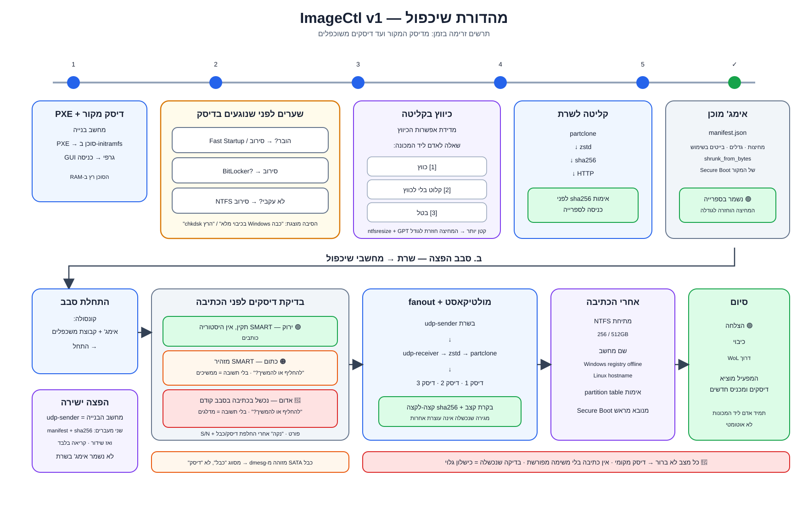

<div align="center">

# ImageCtl

<!-- אין badges: הריפו פרטי, ו-GitHub אינו מגיש badge לקורא אנונימי.
     ה-badges שהיו כאן הצביעו על השם הישן, שתפוס היום על ידי פרויקט אחר,
     והציגו "tests — passing" שלו. סימן ירוק שאינו מעיד על כלום. -->

**שרת אימג'ים ופריסה לכיתות מחשבים.**

[](LICENSE)
[](server/requirements.txt)

</div>

<div dir="rtl">

במקום לשכפל SSD אחד לשני, כונן אחר כונן, המערכת הופכת כל אימג' לקובץ על
שרת ומשדרת אותו במולטיקאסט לכיתה שלמה בבת אחת. **הזמן לשכפל 30 מחשבים
הופך לזמן של מחשב אחד** — והכוננים, הגרסאות והשמות מנוהלים ממסך אחד
בעברית.

</div>

<picture>
  <source media="(prefers-color-scheme: dark)" srcset="docs/architecture-v1-dark.svg">
  
</picture>

<picture>
  <source media="(prefers-color-scheme: dark)" srcset="docs/flow-v1-dark.svg">
  
</picture>

_שני התרשימים משקפים את היקף מהדורת שיכפול (v1) — קונסולה, שרת ראשי ומשני
([#655](https://github.com/NadavOked/ImageCtl-archive/issues/655)), מחשב בנייה
ומחשבי שיכפול. תחנות כיתה/PXE לתלמידים אינן בתרשימים — הן v2._

<div dir="rtl">

## תוכן

- [מה זה פותר](#מה-זה-פותר)
- [איך זה עובד](#איך-זה-עובד)
- [עקרון הבטיחות](#עקרון-הבטיחות)
- [הקונסולה](#הקונסולה)
- [למה זה עובד עם Secure Boot דלוק](#למה-זה-עובד-עם-secure-boot-דלוק)
- [מה נמדד](#מה-נמדד)
- [מצב הפרויקט](#מצב-הפרויקט)
- [התקנה](#התקנה)
- [רשת ופורטים](#רשת-ופורטים)
- [בדיקות](#בדיקות)
- [אבטחה](#אבטחה)
- [מפת הריפו](#מפת-הריפו)
- [רישיון](#רישיון)

---

## מה זה פותר

כיתת מחשבים שצריכה מערכת חדשה מטופלת היום ידנית: שולפים SSD, משכפלים,
מחזירים, וחוזרים 30 פעם. זה לוקח ימים, ותלוי בזה שמישהו לא יתבלבל בין
כונן שכבר טופל לכונן שלא.

**ImageCtl הופך את זה לפעולה אחת:** האימג' יושב על השרת כקובץ, כל
המחשבים עולים ברשת, והשידור מגיע לכולם במקביל. מגירה שנכשלה נכשלת
**בגלוי ובשמה**, בלי לעצור את השאר.

## איך זה עובד

1. **קליטה** — מזמינים "קליטת אימג'" בקונסולה. מחשב הבנייה עולה ב-PXE,
   קורא את הכונן שלו (רק בלוקים תפוסים, דחוס), ומעלה לשרת. **אימות
   `sha256` לפני שהאימג' נכנס לספרייה** — אימג' פגום נתפס בקליטה, לא מול
   כיתה.
2. **ספרייה** — כל אימג' הוא תיקייה עם `manifest.json`. **הדיסק הוא מקור
   האמת:** גיבוי או העברה לשרת אחר הם העתקת תיקייה.
3. **סבב הפצה** — נפתח לכיתה. כל מחשב שעולה ב-PXE מצטרף אוטומטית;
   השידור מתחיל כשכולם הגיעו, כשעבר הזמן מהמצטרף האחרון, או בלחיצה.
4. **שידור** — `udp-sender` אחד, כל הכיתה כותבת במקביל. הקונסולה מציגה
   התקדמות חיה לכל מחשב, בשמו.
5. **שם מחשב** — נכתב אוטומטית לפני האתחול הראשון: `LAB1-05`, לפי טבלת
   ה-MAC. ב-Windows לרג'יסטרי (offline), בלינוקס ל-`/etc/hostname`
   ו-`/etc/hosts`.

**‏Windows 11 ולינוקס הם אזרחים שווים:** אותו מניפסט, אותו זרם, אותו
מסלול. מה שמשתנה — `partclone.ntfs` / `partclone.ext4` /
`partclone.btrfs`, כלי ההרחבה, ואיך נכתב השם. ‏swap לא נשמר ולא משודר —
נוצר מחדש מהמניפסט.

בחדר השיכפולים אותו זרם נכתב ל-2–3 מגירות במקביל, עם בידוד: מגירה איטית
או תקולה נכשלת לבדה, בלי לעצור את השאר.

## עקרון הבטיחות

**ברירת המחדל היא תמיד אתחול מהדיסק המקומי.**

מחשב בלי משימה, ‏MAC לא מוכר, שרת שלא עונה, גרסת ממשק לא מוכרת, חריגה
בקוד — כולם מסתיימים באותו מקום: המחשב עולה רגיל, תוך שתי שניות, בלי
לראות דבר.

זו לא הגנה שנוספה בסוף אלא נקודת המוצא: כל התנהגות אחרת דורשת תנאי
מפורש. **שרת שנפל לא משבית אף כיתה, ואף מחשב לא יכול "פתאום למחוק את
עצמו".**

ולצידו עיקרון שני, שמכתיב את רוב הקוד: **פעולה שלא הצליחה לבדוק —
נכשלת, לא מוותרת.** "לא הצלחנו לבדוק" ו"בדקנו, הכל תקין" הם שני מצבים
שונים, והצלחה נקבעת לפי **ראיה חיובית** — קוד תשובה, מונה, ערך שנקרא
בחזרה — ולא לפי היעדר סימן כישלון.

## הקונסולה

עברית, ‏RTL, מצב בהיר וכהה, בלי אף תלות צד-לקוח.

- **ספריית אימג'ים** — תיקיות, גרירה לסידור, שינוי שם ותיאור, מחיקה
  באישור הקלדת השם, הורדה והעלאה כקובץ יחיד.
- **סבב חי** — מי הצטרף, כמה אחוזים לכל מחשב, ומי נכשל ולמה.
- **מחשבים** — כיתות, שיכפול ובנייה; ייבוא MAC בהדבקה, ייצוא CSV.
- **בריאות** — מה מאזין, על איזה ממשק, ומי נופל לסוכן בלולאה כשלא היה
  אמור.
- **רשת** — כתובת סטטית, gateway ו-DNS מהמסך, **עם החזרה אוטומטית
  שמונעת נעילה עצמית**.
- **הרשאות** — מנהל רואה הכל; משתמש הפצה בוחר אימג' ומפיץ, ותו לא.
- **יומן בעברית** — "כתיבה נכשלה במחשב: 06 · כיתה LAB1", לא שורת לוג עם
  מזהים.

## למה זה עובד עם Secure Boot דלוק

</div>

```
firmware -> shim (Microsoft-signed) -> GRUB (Debian-signed) -> distro kernel -> initramfs
                                                                               ^ הסוכן שלנו, בלי חתימה
```

<div dir="rtl">

ה-initramfs נטען כנתון אחרי הקרנל ולכן אינו דורש חתימה — עדכון הסוכן הוא
החלפת קובץ אחד, בלי מפתחות. ‏GRUB לא מריץ קוד בשרת אלא מושך קובץ תצורה
שמיוצר בזמן אמת לפי ה-MAC.

ו**שום פרט משימה לא עובר בשורת הפקודה של הקרנל** — הכל מגיע מהשרת בערוץ
אחד מתועד ([docs/interfaces.md](docs/interfaces.md)), ויש בדיקות שאוכפות
את זה משני הצדדים.

## מה נמדד

מספרים ממעבדת ה-VM ומהמחשב הפיזי, לא הערכות:

| | |
|---|---|
| שידור אימג' tiny11 (‏7.3GB, ‏4 מחיצות) | **5:54 דק'** |
| שידור אימג' אובונטו (‏468MB) | **52 שנ'** |
| הרחבת מחיצה על דיסק פיזי | ‏273.7GB → **498.9GB** |
| חבילת הבדיקות | **1054 בדיקות, אפס דילוגים**, על 3.12 ו-3.13 |
| סימולציית קצה-לקצה | **94 בדיקות** |

**זמן השידור אינו תלוי במספר המחשבים** — זו כל הנקודה של מולטיקאסט.
אותם 7.3GB לכיתה שלמה לוקחים אותו זמן כמו למחשב אחד.

## מצב הפרויקט

**המערכת רצה מקצה לקצה במעבדת VM מלאה**, וב-2026-08-29 נכנס מחשב Lenovo
פיזי וסגר עשר בדיקות על ברזל אמיתי — שרשרת אתחול תחת Secure Boot
‏Deployed, שחזור, הרחבה על דיסק פיזי, ומקלדת USB באשף.

**ומה שעדיין לא הוכח נאמר במפורש ולא נבלע.** יש
[מטריצת אימות](docs/lab-test-plan.md) (סעיף 1א)
שאומרת מה מוכיחים בכל סביבה, ו-milestones בריפו שמחזיקים גם **Issues
סגורים שממתינים לראיה על מכונה**:

- **מולטיקאסט על מתג מנוהל** — הפער הגדול ביותר. אין תחליף ל-VM.
- **צי מעורב** — כל יצרן וכל סדרה. שלושה באגים חוסמי-התקנה נמצאו כך.
- **הייפרוויזרים אחרים** — יש דרייברים בקוד ל-ESXi/KVM/Xen; אין מכונה
  לבדוק עליה.

**חבילת בדיקות ירוקה היא ראיה על הלוגיקה, לא על המכונה.** ההבחנה הזו
נאכפת גם בקוד: `IMAGECTL_REQUIRE_NATIVE=1` הופך דילוג של בדיקה לכישלון,
כדי ש"עבר" לא יוכל להיות "לא רץ".

## התקנה

**צד השרת** — פייתון עם שתי תלויות מוצמדות:

</div>

```bash
pip install -r server/requirements.txt
python -m server.main --server-url http://10.44.12.10:8080
```

<div dir="rtl">

בהרצה הראשונה מודפסת סיסמת ה-admin — **פעם אחת בלבד**. להרצה קבועה יש
יחידת systemd מוכנה: [docs/server.md](docs/server.md).

**שרת האתחול (PXE)** — קובץ אחד, עצמאי לגמרי. אין צורך ב-git או בפייתון:

</div>

```bash
sudo ./install/setup-boot-server.sh --servers-if eth0
# כרטיס השרתים מקבל DHCP מהמכללה; רשת ההפצה **לא** מוגדרת בהתקנה —
# המנהל מגדיר אותה מהקונסולה (דף הרשת: כרטיס → כתובת סטטית → DHCP). ‏#1088
```

<div dir="rtl">

ברירת המחדל היא מצב **proxy**: ‏dnsmasq עונה רק על שאלות PXE ולא מחלק
כתובות, כך שמתחברים לרשת חיה בלי להתנגש ב-DHCP הקיים. יש גם `--dry-run`
שמראה הכל בלי לשנות דבר. המדריך המלא:
[docs/server-install.md](docs/server-install.md).

**הסוכן** — נבנה פעם אחת על מכונת דביאן ומועתק לשרת האתחול:

</div>

```bash
sudo ./tools/build_initramfs.sh
```

<div dir="rtl">

## רשת ופורטים

**מה צריך להיות פתוח, ומה לא.** הטבלה נגזרת ממה שהמערכת באמת פותחת
(‏`server/ports.py`, `install/nftables-rules.sh`), ודף הפורטים בקונסולה מציג
את אותם מתגים — עם אזהרה אדומה לפני כל כיבוי.

| שירות | פורט | איפה | הערה |
|---|---|---|---|
| ‏HTTP — תפריט GRUB, קרנל, initrd, ‏API של הסוכן, משיכת אימג' | `8080/tcp` | וילן ההפצה | http בלבד — ה-GRUB החתום נבנה בלי TLS |
| **‏HTTPS — הקונסולה/הניהול** | `8081/tcp` | כרטיס הניהול בלבד | **תעודה חתומה-עצמית, HTTP אינו מוגש** (‏#703). ראו למטה |
| ‏HTTP — קיוסק (מסך התחנה) | `8082/tcp` | וילן ההפצה | |
| ‏mTLS — הערוץ הבין-שרתי (ראשי⇄משני) | `8443/tcp` | בין האתרים, מכתובת הראשי בלבד | רק כשיש שרת משני; הראשי תמיד יוזם |
| ‏TFTP — טעינת ה-bootloader בלבד | `69/udp` | וילן ההפצה | מתג בקונסולה (#1013); דורש `nf_conntrack_tftp` בחומת אש מצבית |
| ‏DHCP | `67/68/udp` | וילן ההפצה | ברודקאסט מקומי — לא מנתבים; מוגדר מהקונסולה, לא בהתקנה (#1088) |
| ‏PXE proxy יוניקאסט | `4011/udp` | וילן ההפצה | רק כשה-DHCP אינו שלנו |
| **מולטיקאסט (זרם ההפצה)** | **`9000-9001/udp`** | וילן ההפצה בלבד | ‏`9000` היא ברירת המחדל של udpcast; שני פורטים לכל שידור (`portbase` ו-`portbase+1`) |
| ‏WoL | `9/udp` ברודקאסט | השרת → וילן ההפצה | לא יוצא מהוילן |
| מוניטור (צפייה ושליטה במחשבי בנייה/שיכפול) | `5900/tcp` | השרת → התחנות, וילן ההפצה | מתג בקונסולה, **כבוי כברירת מחדל**; הדפדפן רואה את זה דרך 8081 בלבד |
| ‏SSH לתחנות (כלי טכנאי) | `22/tcp` | השרת → התחנות | מתג `ssh:stations`, **כבוי כברירת מחדל**; dropbear ב-initramfs |
| ‏SSH לשרת | `22/tcp` | — | **אין SSH על שרת הייצור** (#1148): מתג טכנאי כבוי, ‏sshd על loopback בלבד |

**‏`--ttl` אינו מועבר ל-udpcast**, וה-man page שלו מציין שיציאה מהרשת
המקומית "לא נבדקה בהיעדר נתב מולטיקאסט" — הזרם נשאר בוילן ההפצה.

### הקונסולה על פורט משלה, ב-HTTPS

עד #731 הקונסולה חלקה את `8080` עם הסוכן, וחומת אש לפי פורט לא יכלה
להפריד ביניהם. מאז (#703, tracers 1–5) **הגבול הוא ה-socket**: הקונסולה
(`/console/`, `/api/console/`) על `8081` וכרטיס הניהול בלבד
(`--console-host`), **ב-HTTPS בלבד** — תעודה חתומה-עצמית שנוצרת פעם אחת
ב-`/var/lib/imagectl/console-tls/`, הדפדפן מאשר אותה פעם אחת אחרי
השוואת טביעת האצבע שהמתקין/השרת הדפיסו. ‏`8080` נשאר http לתחנות.
המפרט המלא ב-[`install/firewall-rules.md`](install/firewall-rules.md) ומימוש
ההתייחסות ב-[`tools/lab/firewall/`](tools/lab/firewall/).

**מה שבטוח לחסום תמיד, מוילני הכיתות אל השרת:**

| | |
|---|---|
| `22/tcp` | ‏SSH — אין SSH על שרת הייצור בכלל (#1148); מכיתה בוודאי לא |
| כל השאר | ‏deny כברירת מחדל |

**ומהשרת אל וילני הכיתות:**

| | |
|---|---|
| `9000-9001/udp` | זרם ההפצה לא יוצא מוילן ההפצה |
| `9/udp` ברודקאסט | ‏WoL הוא לוילן ההפצה בלבד |

### מה מנהל הרשת מגדיר בסוויץ' ההפצה — לא בקוד

המערכת שולטת במי **משתתף** (MAC רשום, בחירה בקונסולה, sha256 על כל
אימג'). היא **אינה** שולטת במי **מחובר לכבל**: זרם ההפצה הוא מולטיקאסט,
והסוויץ' — לא השרת — מחליט לאילו פורטים הוא מגיע. מחשב זר שמחובר
לסוויץ' ההפצה יכול להצטרף לקבוצה ולקבל את האימג', או לשדר בעצמו
(‏#1079, מפתח לסבב — בתור). עד אז ההגנה על הכבל היא של הסוויץ', וזו
הרשימה שמנהל הרשת צריך לעבור עליה **לפני** שהמערכת נכנסת לשימוש:

| הגדרה | מה | למה |
|---|---|---|
| **וילן הפצה נפרד** | פורטי access לשרת (כרטיס ההפצה), למחשבי הבנייה ולמחשבי השיכפול בלבד. **בלי ניתוב** לוילן הניהול/הכיתות/האינטרנט | 8080, 69, 67, 4011 והמולטיקאסט חיים רק שם; זו ההנחה של כל טבלת הפורטים למעלה |
| **Port security** | פורט ↔ MAC אחד (sticky), פורט שלא בשימוש — **כבוי** | לפטופ זר שמתחבר לפורט של מחשב שיכפול → הפורט נסגר. זה מה שהרישום בקונסולה **לא** יכול לעשות: MAC אפשר לזייף בתוכנה, פורט פיזי לא |
| **IGMP snooping + querier** | snooping דלוק, ‏querier אחד בוילן (הסוויץ' או השרת), גרסה v2 | בלי querier טבלת החברות פוקעת אחרי 125–260 שניות והזרם נופל באמצע שיכפול, או שהסוויץ' מציף את כל הוילן. ראו `docs/imagectl-spec.md` §"IGMP — נקודת הכשל המרכזית" |
| **בלי DHCP זר בוילן** | השרת הוא ה-DHCP היחיד של וילן ההפצה; מסננים DHCP-offer מפורטים אחרים (DHCP snooping, פורט השרת = trusted) | זהות מכונה = MAC + חכירה של השרת (#855); DHCP זר שובר את הבדיקה **ו**את ה-PXE |
| **בלי 802.1X על פורטי ההפצה** | לא להפעיל | מחשב שעולה מ-PXE אין לו עדיין מערכת שתתאמת — הפורט לא יעלה והמחשב לא יראה את התפריט. ‏Port security הוא התחליף |
| **תיוג פיזי** | על כל פורט: איזו מכונה יושבת בו | "מחשב 2 לא מקבל" — לדעת תוך שנייה אם זה כבל, פורט או תוכנה |

מה שהקוד **כן** בודק: "מי עוד עונה" בדף הרשת (#1039) — שרת DHCP או
כתובות זרות בוילן ההפצה מסומנים באדום; והשידור נקשר לכרטיס ההפצה
בלבד (#1079-S). שניהם **מזהירים** — הם אינם חוסמים כבל.

### ערוץ התחנות (8080) אינו מוצפן

**הקונסולה (8081) והערוץ הבין-שרתי (8443) מוצפנים**; **ערוץ התחנות על `8080`
הוא HTTP גלוי, כולל סיסמת משתמש ההפצה** ב-`POST /api/v1/agent/login`
מהקיוסק. ‏`GrubConfig` אף **אוכף** `http://` ודוחה `https://`, כי ה-GRUB
החתום של דביאן נבנה בלי TLS ו-`http` module שלו מדבר HTTP פשוט בלבד
(אימות ערוץ הסוכן — #1076).

בסוויץ' תקין האזנה פסיבית לא תראה תעבורת יוניקאסט של מכונה אחרת, אבל
**‏ARP spoofing** כן — וזה כלי סטנדרטי. **נתוני ההפצה במולטיקאסט גלויים לכל
מי שמצטרף לקבוצה**, וזה בתכנון.

</div>

<div dir="rtl">

## בדיקות

</div>

```bash
python -m pytest tests -q                          # 1054 בדיקות, אפס דילוגים
IMAGECTL_REQUIRE_NATIVE=1 python -m pytest tests -q  # דילוג = כישלון
python tools/e2e_simulation.py                     # הלולאה המלאה מול שרת רץ
```

<div dir="rtl">

הבדיקות רצות ב-GitHub Actions על **שתי גרסאות פייתון** בכל push ובכל PR,
כולל בדיקות הכותב המקבילי שדורשות `gcc`.

`IMAGECTL_REQUIRE_NATIVE=1` קיים כי חבילה שדילגה בשלמותה נראית בדיוק כמו
חבילה שעברה. **על שרת המעבדה היעד הוא אפס דילוגים לא-מוצהרים.**

היוצא מן הכלל הוא דילוג **מוצהר** (#295): טסט שדורש כלי הקיים רק על תחנת
הפיתוח — ‏PowerShell, שאינו על שרת המעבדה בכוונה, כי במכללה לא יהיה
PowerShell על השרת. הריצה מדפיסה בסופה כמה טסטים דולגו כך ומאיזו סיבה,
בשמם. דילוג כזה אינו מפיל, אבל גם אינו שקט — אדום קבוע מנרמל את עצמו עד
שכשל אמיתי נבלע בתוכו.

## אבטחה

המערכת כותבת לדיסקים ומאתחלת מחשבים. **דיווח על חולשה:**
[SECURITY.md](SECURITY.md) — Issue בארכיון הפרטי מותר; פרסום לציבורי
לפני תיקון אסור.

בפריסה: הקונסולה (8081, HTTPS) יושבת על **וילן השרתים** ואינה נגישה מוילן
ההפצה או מוילני הכיתות (nftables לפי וילן, #1074); ערוץ התחנות (8080/8082,
67/69, מולטיקאסט) על וילן ההפצה בלבד; ומתגי ה-SSH לתחנות ולשרת סגורים
כברירת מחדל.

## מפת הריפו

| | |
|---|---|
| [docs/imagectl-spec.md](docs/imagectl-spec.md) | **האפיון** — מה המערכת עושה, למה, ובאילו אילוצים |
| [docs/interfaces.md](docs/interfaces.md) | **מקור האמת** — כל מה שעובר בין הרכיבים |
| [docs/server.md](docs/server.md) | השרת והקונסולה, כולל פריסה כשירות |
| [docs/agent.md](docs/agent.md) | הסוכן: החלטות, שחזור, קליטה, חדר שיכפולים |
| [docs/grub-generator.md](docs/grub-generator.md) | מחולל תפריט ה-GRUB וטבלת ההחלטה |
| [docs/server-install.md](docs/server-install.md) | התקנת שרת האתחול |
| [docs/lab-test-plan.md](docs/lab-test-plan.md) | תוכנית הבדיקות ומטריצת האימות |
| [docs/verification-register.md](docs/verification-register.md) | מה מתוכה **הורץ**, על איזו סביבה, ו**מה נמדד** |
| [CHANGELOG.md](CHANGELOG.md) | מה השתנה בכל גרסה |
| `server/` · `agent/` · `boot/` | הקוד: קונסולה ו-API · initramfs · שרשרת אתחול |
| `install/` · `tools/` | התקנה עצמאית, בניית initramfs, סימולציה |

**הגרסה הנוכחית היא [התג האחרון](https://github.com/NadavOked/ImageCtl-archive/tags)**
— המספר לא נכתב כאן, כדי שהמסמך לא יפגר אחרי התגים.

## רישיון

[MIT](LICENSE) · ‏© 2026 Nadav Oked

</div>
